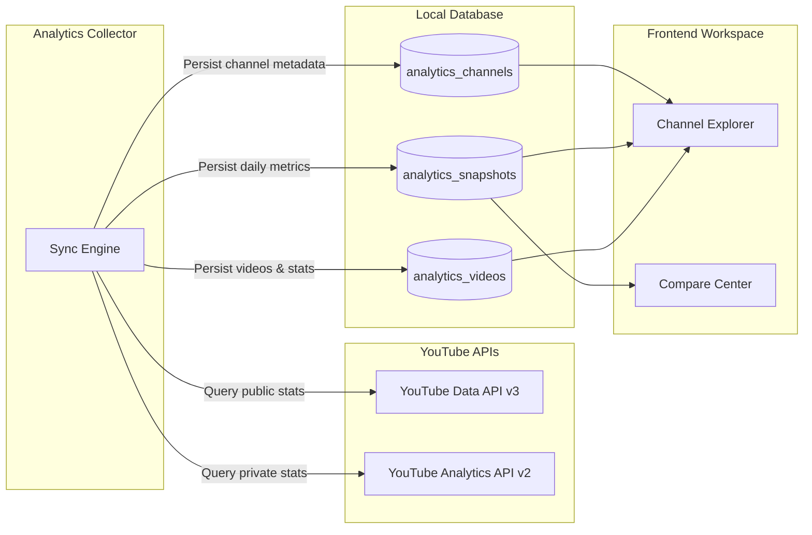

# Architecture — Analytics Domain & Intelligence Layer

The Analytics Domain is a completely isolated observation layer designed to store, aggregate, and compare historical performance data of registered channels without mixing operational publishing lifecycles.

## 1. Domain Decoupling
The Analytics domain is decoupled from sub-channel workspaces and publishing schedules:
*   Deleting a workspace channel does not delete its historical analytics snapshots.
*   Archiving observed channels is a logical state change (`is_archived = True`, sync status `DISABLED`), preserving data records for future historical modeling.

## 2. Dynamic Collector Sync Types
The collector (`backend/services/analytics/collector.py`) resolves statistics based on registry metadata:
*   **Owned Channels (`analytics_type = "owned"`)**: Resolves OAuth credentials, querying private metrics (impressions, CTR, watch time, audience retention) from the YouTube Analytics API. estimative fallbacks populate snapshots if API sandboxes block requests.
*   **Competitor & Observed Channels (`analytics_type = "competitor" / "observed"`)**: Queries public stats (views, subscribers, public videos) from the YouTube Data API. Private metrics are locked to null/zero.

## 3. Compare Dates Alignment Algorithm
Comparative timelines require aligned dates for charts. The alignment algorithm resolves gaps:
1.  Queries past snapshots of selected channels (between 2 and 5 items).
2.  Extracts all unique dates and filters to the last 30 entries.
3.  Maps dates sequentially, loading metric values for each channel.
4.  Appends null placeholders if a channel lacks a snapshot on a specific date, preventing layout breakage in Recharts.
5.  Outputs separate `subscribers_timeline` and `views_timeline` lists where channel IDs serve as direct data keys.
