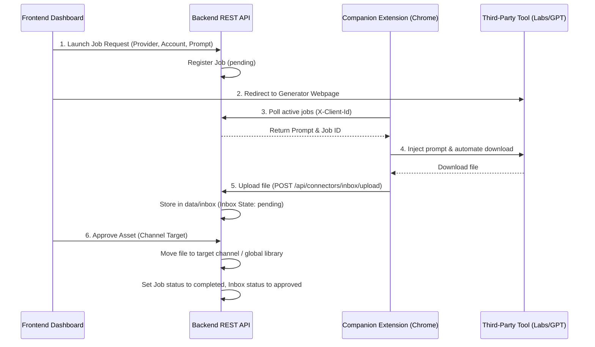

# Architecture — Global Connector Hub & Asset Inbox

The Connector Hub acts as the platform-level orchestration center for connecting third-party generative networks (such as Google Labs, Gemini, and ChatGPT) to Content Factory.

## 1. Relocation to Platform Level
To prevent redundant implementations in individual sub-channel workspaces, all connection infrastructure is mounted at the global platform level `/connectors`:
*   Allows shared usage of connection profiles across all sub-channels.
*   Enables future pipeline extensions (Footage, Scenes, Characters) to leverage the same underlying connector adapters.

## 2. Dynamic Job State Machine
Jobs pass through a strict lifecycle in the database `connector_jobs` registry:
1.  **Pending**: Job registered by the frontend workspace form, waiting to be claimed.
2.  **Opened**: Claimed and read by the Companion Extension during periodic poller checks.
3.  **Completed**: Generated asset is uploaded and approved by the user.
4.  **Failed / Expired**: Handled on network errors or timeout expiration.

## 3. Asset Inbox Pipeline
The Asset Inbox provides a safety buffer before files enter the permanent libraries:
*   **Staging Directory (`data/inbox`)**: Uploaded multipart files are stored temporarily.
*   **Action Routing**:
    *   **Approve**: Moves files to sub-channel assets (`data/channels/<slug>/<asset_type>/`) or the platform shared library (`data/shared/<asset_type>/` if target sub-channel is null).
    *   **Reject**: Deletes files and sets status to rejected.
    *   **Archive**: Flags record as archived.
