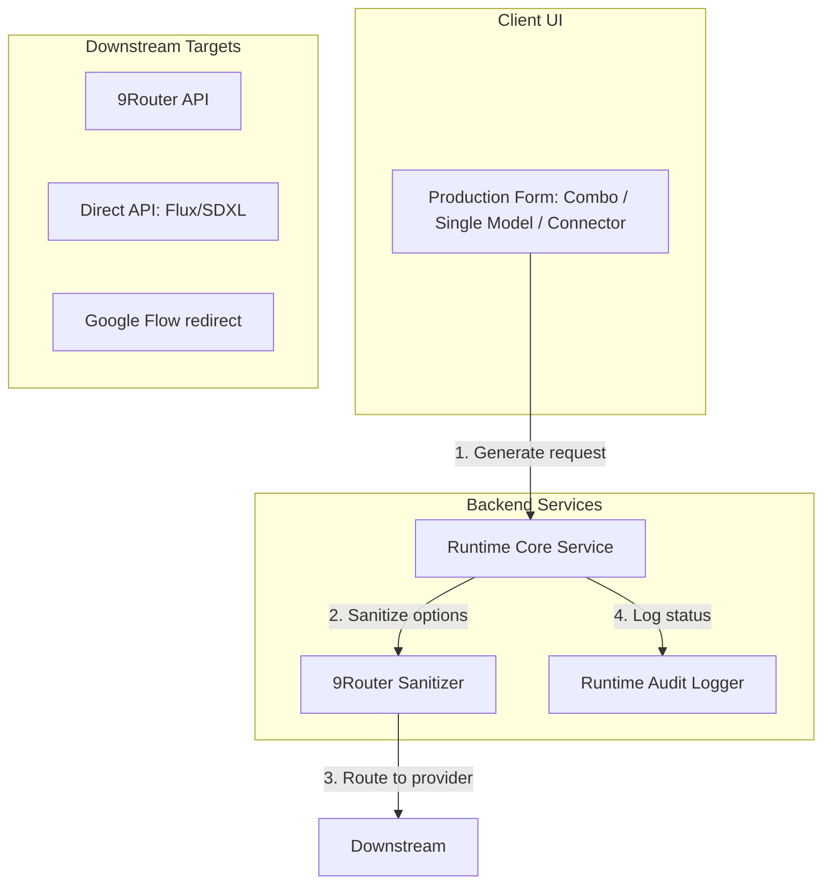

# Architecture — Production Domain & Generation Studio

The Production Domain manages prompt context configuration, model configurations, and runtime asset generations.

## 1. 3-Way Generation Architecture
The execution framework supports three modular execution paths:
1.  **Combo Mode (9Router)**: Routes prompts through the 9Router, utilizing pre-configured prompt chains and combo templates.
2.  **Single Model Mode (Direct API)**: Communicates directly with generative endpoints, loading settings from local database options.
3.  **External Connector Mode (Companion Extension)**: Registers background tasks, redirecting user browsers to Google Labs Flow or ChatGPT for companion execution.

## 2. 9Router Payload Sanitizer
To prevent API failures (Error 400) and hang issues during non-GPT model generations, the `sanitize_9router_payload` utility interceptor executes several adapter mappings:
*   **JSON Mode Stripping**: Removes `response_format` specifications when non-GPT models are invoked.
*   **Penalty Parameters Cleanups**: Strips `presence_penalty` and `frequency_penalty` attributes.
*   **Token Caps & Timeouts**: Enforces maximum token counts and maps request timeouts dynamically from database settings.
*   **System Role Translation**: Converts `system` instruction roles to `user` structures (prepending with `[System Instructions]`) to support models that require system instructions inside user message streams.
